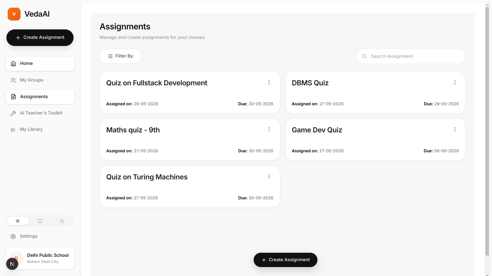
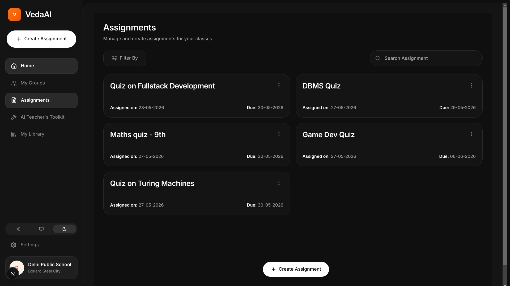
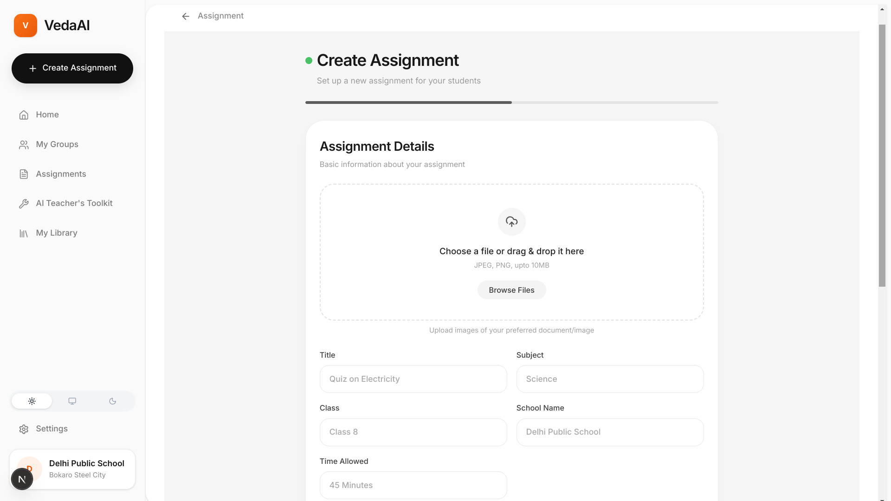
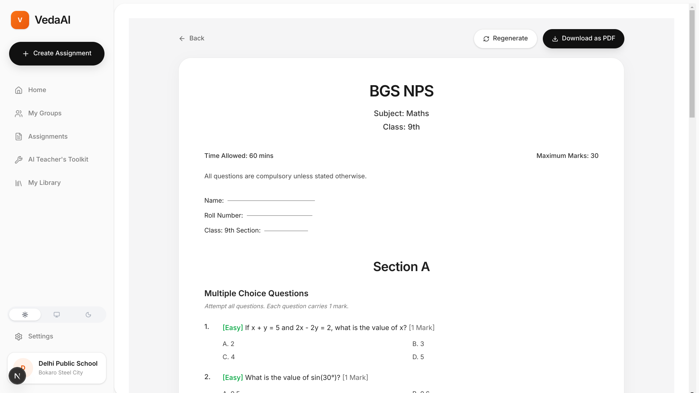

# VedaAI

AI-powered assessment generation platform built as a full-stack engineering assignment.

VedaAI enables teachers to generate structured assessments using AI, receive real-time generation updates, and view professionally formatted question papers through a scalable background job architecture.

---

# Features 

- AI-powered question paper generation 
- Structured AI response parsing 
- Section-wise question formatting 
- Difficulty classification & marks distribution 
- Assignment regeneration 
- Real-time generation updates using WebSockets 
- Background processing using BullMQ 
- PDF / text upload support 
- Light / Dark / System theme support 
- Responsive UI 
- Dockerized full-stack setup

---

# Tech Stack

## Frontend

* Next.js
* React
* TypeScript
* Zustand
* Tailwind CSS
* next-themes

## Backend

* Node.js
* Express.js
* TypeScript
* MongoDB
* Redis
* BullMQ
* ws (WebSocket Server)
* Multer

## AI

* Groq API
* `llama-3.3-70b-versatile`

## DevOps

* Docker
* Docker Compose

---

# Architecture Overview

```txt
                ┌──────────────────┐
                │    Frontend      │
                │  Next.js + TS    │
                └────────┬─────────┘
                         │
                  HTTP + WebSocket
                         │
                ┌────────▼─────────┐
                │     Backend      │
                │ Express + TS     │
                └────────┬─────────┘
                         │
          ┌──────────────┼──────────────┐
          │              │              │
 ┌────────▼──────┐ ┌────▼─────┐ ┌──────▼──────┐
 │   MongoDB     │ │  Redis   │ │   BullMQ    │
 │ Assignments   │ │ Caching  │ │ Background  │
 │ & Results     │ │ JobState │ │ Workers     │
 └───────────────┘ └──────────┘ └──────┬──────┘
                                       │
                              ┌────────▼────────┐
                              │ AI Generation   │
                              │ Groq LLM API    │
                              └─────────────────┘
```

---

# Project Structure

```bash
project/
│
├── frontend/
├── backend/
│   ├── workers/
│   └── uploads/
│
├── docker-compose.yml
├── .env
└── README.md
```

---

# Setup Instructions

## Prerequisites

Install:

* Docker
* Docker Compose

Verify installation:

```bash
docker --version
docker compose version
```

---

# Environment Variables

Create a `.env` file in the project root.

```env
GROQ_API_KEY=your_groq_api_key
GROQ_MODEL=llama-3.3-70b-versatile
```

---

# Running the Project

## Clone the Repository

```bash
git clone <repository-url>
cd <project-folder>
```

## Start All Services

```bash
docker-compose up --build
```

This starts:

* frontend
* backend
* MongoDB
* Redis
* BullMQ workers

---

# Access the Application

Frontend:

```txt
http://localhost:3000
```

The application automatically redirects to:

```txt
/assignments
```

Backend API:

```txt
http://localhost:5000
```

---

# Application Workflow

```txt
1. Teacher creates assignment
2. Backend adds generation job to BullMQ
3. Worker processes AI request
4. AI response is parsed and structured
5. Results stored in MongoDB
6. WebSocket pushes live updates
7. Frontend renders formatted question paper
```

---

# Key Engineering Decisions

## Structured AI Parsing

The system does not directly render raw LLM responses. AI output is parsed into structured sections, questions, difficulty levels, and marks before rendering.

## Real-Time Architecture

WebSockets are used to push live assignment status updates during long-running AI generation tasks.

## Scalable Job Processing

BullMQ + Redis handle asynchronous AI generation through worker-based background processing.

## State Management

Zustand is used for lightweight and efficient frontend state management.

## Theme System

Supports Light, Dark, and System themes using `next-themes`.

---

# File Processing

* PDF / text upload support
* Parsing using `pdfreader`
* Context-aware AI prompt enhancement

---

# Useful Commands

## Run in Background

```bash
docker-compose up -d --build
```

## Stop Project

```bash
docker-compose down
```

## Remove Containers + Volumes

```bash
docker-compose down -v
```

## View Logs

```bash
docker-compose logs
```

---

# Future Improvements

* Teacher / Student authentication
* Scheduled quiz releases
* Online quiz-taking system
* AI-based answer evaluation
* Student performance analytics
* Production-grade PDF exports

---

# Screenshots

## Light Theme



## Dark Theme



## Assignment Creation



## Generated Question Paper


---

# Engineering Focus Areas

* scalable backend architecture
* asynchronous AI workflows
* real-time communication
* structured AI response parsing
* modular system design
* Dockerized local development
